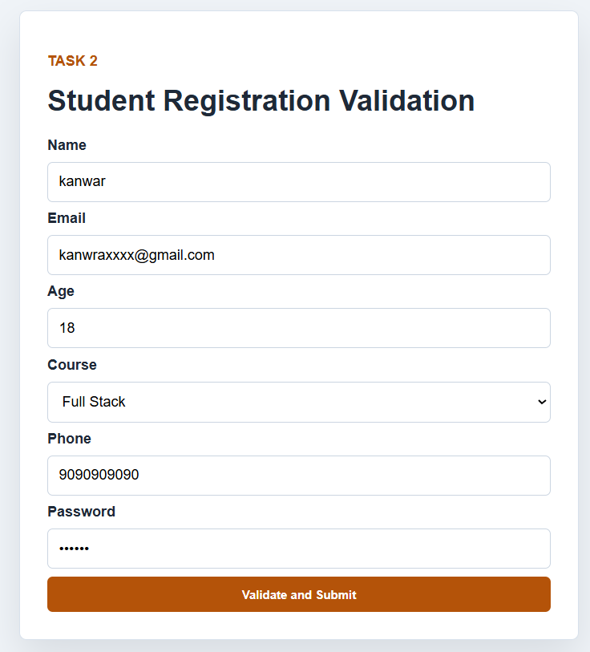
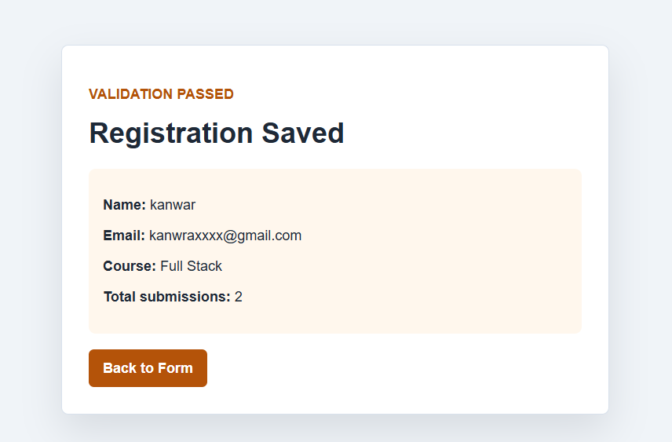

# Task 2 - Form Validation

## Objective

Build an Express and EJS registration form with server-side validation for required fields, email, age, course, phone, and password.

## Folder Structure

```text
Task-2-Form-Validation/
  app.js
  package.json
  public/css/style.css
  views/index.ejs
  views/success.ejs
  README.md
```

## Required npm Packages

- express
- ejs
- nodemon

## File Names

- app.js
- views/index.ejs
- views/success.ejs
- public/css/style.css

## How to Run

```bash
npm install
npm start
```

Open `http://localhost:3002`.

## Screenshot

### Server running



### Submission



## Step-by-Step Implementation

1. Configure Express, EJS, static files, and URL-encoded body parsing.
2. Create a reusable `validateStudent` function.
3. Render validation errors beside each field.
4. Preserve old form input after failed validation.
5. Show a success page after valid submission.
