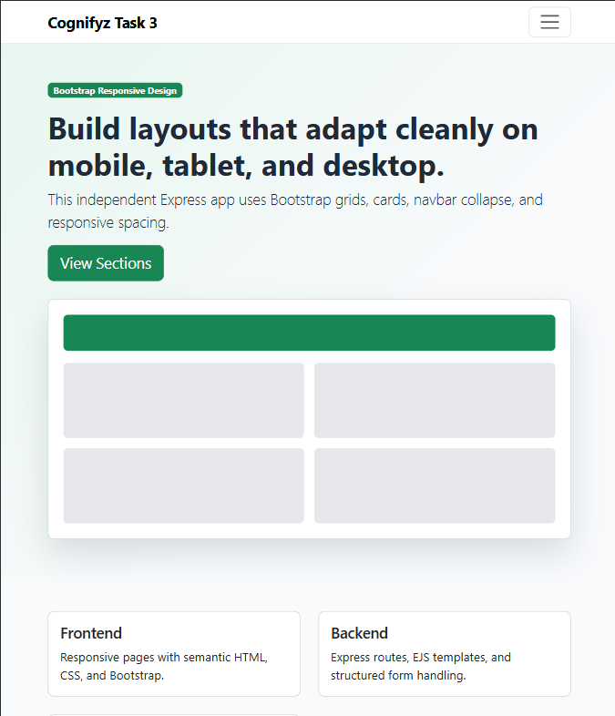
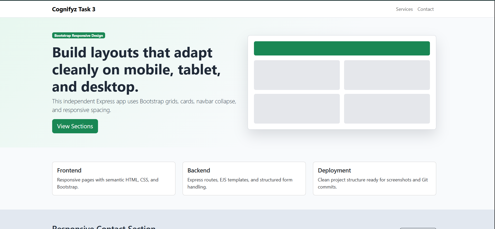

# Task 3 - Responsive Design

## Objective

Create a responsive Express and EJS page using Bootstrap components, grid layout, navbar collapse, cards, and mobile-first styling.

## Folder Structure

```text
Task-3-Responsive-Design/
  app.js
  package.json
  public/css/style.css
  views/index.ejs
  views/success.ejs
  README.md
```

## Required npm Packages

- express
- ejs
- bootstrap
- nodemon

## File Names

- app.js
- views/index.ejs
- views/success.ejs
- public/css/style.css

## How to Run

```bash
npm install
npm start
```

Open `http://localhost:3003`.

## Screenshots

### Mobile view

<video src="./screenshots/responsize design.mp4" width="400" height="500" controls></video>

### Tab View



### Desktop view



## Step-by-Step Implementation

1. Install Express, EJS, Bootstrap, and Nodemon.
2. Serve Bootstrap from `node_modules`.
3. Build a responsive navbar with collapse behavior.
4. Use Bootstrap rows and columns for responsive sections.
5. Add custom CSS for visual polish and mobile adjustments.
